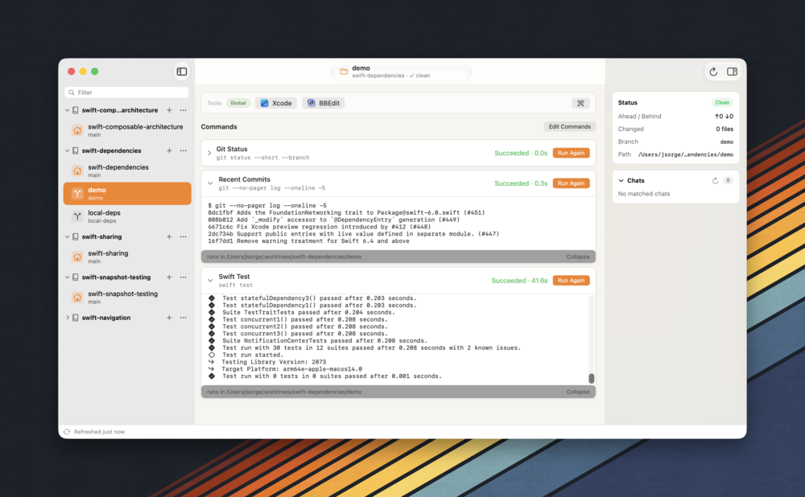
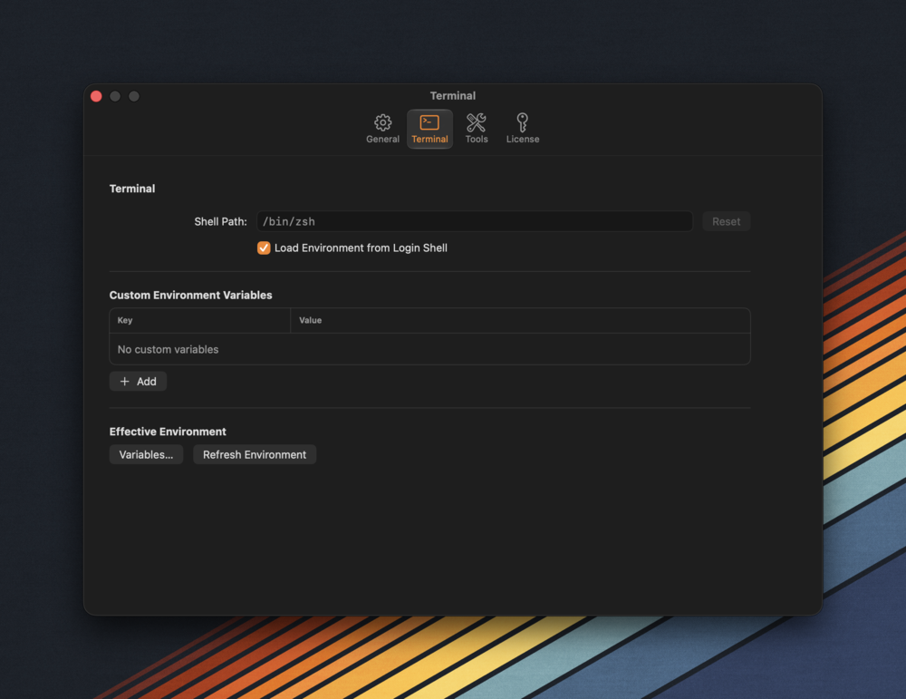

TL;DR: My new app [Arborist](https://taphouse.io/arborist) is now available for download and purchase!

Over the years, as my workflows have evolved, my tools have somewhat struggled to keep up. In any project I work in, I like having multiple checkouts — maybe I'm building a feature, fixing a bug, and doing a code review. Not necessarily at the same time (as there lies madness in the multitasking), but in different places on my drive so I don't have to stash what I'm doing and restore it later. This workflow evolved from multiple clones to [git worktrees](https://git-scm.com/docs/git-worktree). Worktrees are great because they let me create a whole new checkout on my local machine without having to wait for a clone. I love how fast they are, and because they all share a common `.git` root I can easily move between branches and cherry-pick commits if I need to.

All of this came with a cost I wasn't expecting as I started accumulating non-trivial shell commands to run in my repo: there's the Python script at work which pulls binary dependencies, or the long fastlane incantation to make a build, and many others. These commands often require context which works well in a single-tree repo, but when I had multiple checkouts or worktrees I'd have to redo the setup for any location I was working in. I started to wonder if there's some way to manage all this.

That idea has clanked around in my head for a while and finally I have an answer: [Arborist](https://taphouse.io/arborist). It's my new Mac app which lets me take control of worktrees across my system and run any command I want. I've been building this app and using it every day for a while now; today it's available for everyone running macOS 15 and above.

I'm really happy with how Arborist has turned out. It's chock full of features:
* Drag and drop your git repos and it automatically picks up all the associated worktrees and lists them right in the sidebar. The current branch is displayed right under the worktree name.
* Rearrange and collapse sidebar items to get things organized just the way you want.
* Create and delete worktrees with ease. [Tower](https://www.git-tower.com) added worktree support a while back and while I have used that feature I haven't loved it, because it feels like adding a whole new repository. I wanted to make worktree management seamless, and that's just how it is in Arborist. Also, AI agents love to use worktrees but they name them _the same as the repo_ so I've been stuck at times with 3 or 4 identically named locations and I don't know why each of them is there. I can take the power back with Arborist.
* The middle column is the superpower:
	* The commands area stores any terminal commands that you want to run in your repo, and they'll work across checkouts. I use this for both quick and longer tasks and it's the killer feature of the whole app in my view. There's a small console that pops open and shows the terminal output in real time. It's _fantastic_!
	* Tools – at the top of the column – are the apps that you use no matter which repo you're working in. I'm a big fan of [Panic's Nova](https://nova.app) for my non-Xcode projects, and I want to be able to open any worktree in Nova with a single click. Arborist lets me do just that.
* The shell environment that both commands and tools run in is fully customizable in Settings, and you can see the environment variables that Arborist uses to run commands and launch tools.

* The inspector pane on the right side gives me details about the checkout I've got selected. The best part about it is the conversation recall for that worktree so I can see the sessions I've had with Claude or Codex. 
	* Clicking on a conversation launches you right back into that conversation. This proved really valuable to me when I couldn't find a conversation in Codex but I could resume it in Arborist.
	* The sessions are discovered by reading the local files in their known locations, and no data about these conversations ever leaves your machine. Arborist is 100% privacy-focused.

I've worked really hard to make Arborist [Mac-Assed](https://inessential.com/2020/03/19/proxyman) as well, with good keyboard support and a squircle-free alternate icon to boot (I freaking love that icon and use it myself on my machine). I've loved the Mac platform since the early '90s and I want to make a Mac app that Mac people will love to use.

In my last post, I [wrote about](https://jsorge.net/2026/07/15/revenuecat-mac-licensing) using RevenueCat for my licensing. I'm really happy with how that turned out, and I think the ease of tying a license to an iCloud account will make for incredibly smooth transfers to new machines.

Arborist comes with a 14-day free trial, and after that costs $39 for a full-feature license to v1 and all the updates in the v1 family. If and when a v2 comes, there will be a discount available to v1 owners (I don't know when a v2 will ship, that's all way in the future at this point).

I hope you give [Arborist](https://taphouse.io/arborist) a try and that it helps you take control of your workflows.