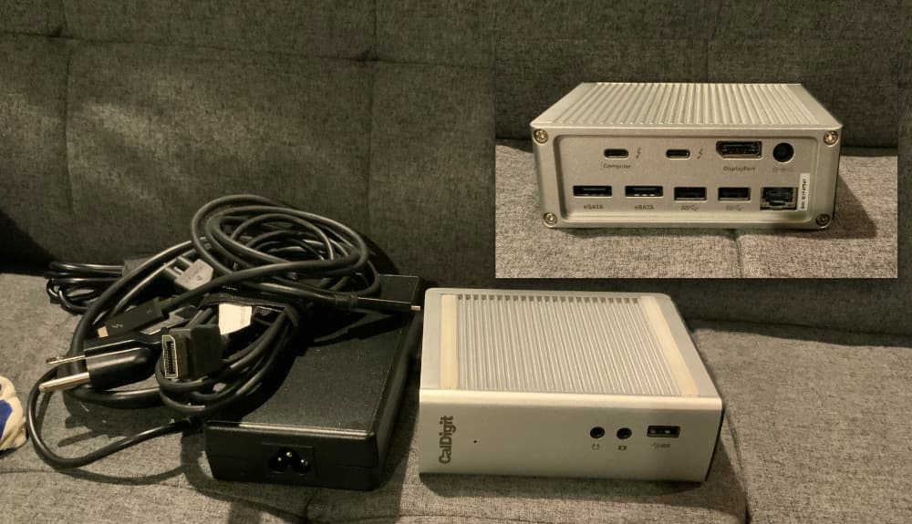
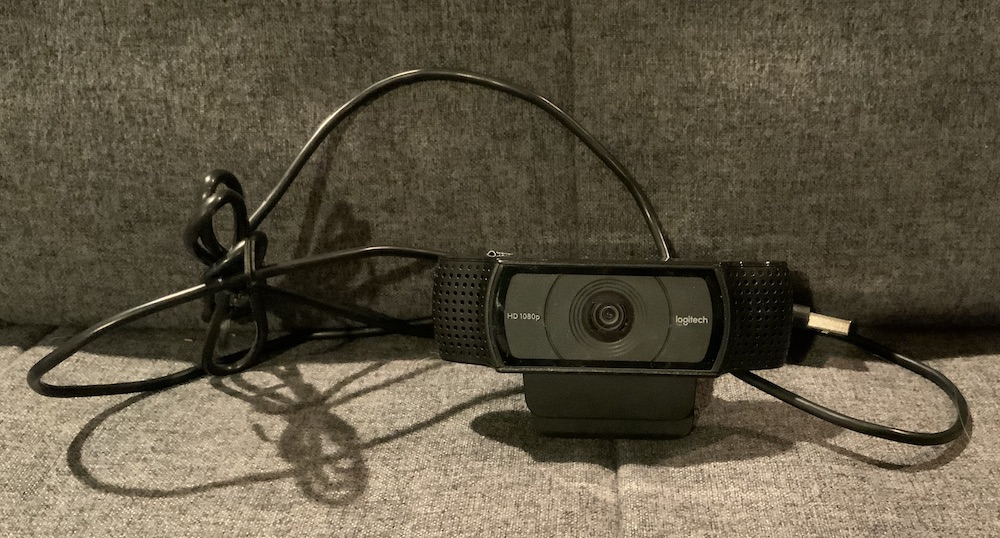

All items priced to include shipping in the Continental U.S. If interested get in touch at garagesale@jsorge.net

## Kinesis Advantage2 LF Keyboard

This is a [Kinesis Advantage2 LF](https://kinesis-ergo.com/shop/advantage2-lfq/) ergonomic mechanical keyboard. It features the quiet Cherry MX switches and has been in use since September 2019. The level of customizability you get with this keyboard is pretty astounding. Includes extra keycaps to swap back to a PC layout (or really whatever layout you choose).

**$299**

## CalDigit TS3 Thunderbolt Dock

This CalDigit Thunderbolt 3 dock ([link to English manual](http://downloads.caldigit.com/CalDigit_TS3_Manual_EN.pdf)) is fantastic. It's got a lot of ports on it, and will power your MacBook up to 85W worth of power. The single-cable lifestyle really is fantastic. Included is a 1-meter Thunderbolt 3 cable as weell as a USB-C -> DisplayPort cable.

Ports:

* 3 USB-A
* Thunderbolt 3
* Gigabit Ethernet
* 2 eSATA
* Audio in/out

**$129**

## Logitech C920 Webcam

I'm probably burying the most sought after product on the list here, but who am I kidding? Someone's gonna want this really good webcam in our current day and age 🙂 ([Logitech site](https://www.logitech.com/en-us/product/hd-pro-webcam-c920))

**$75**
