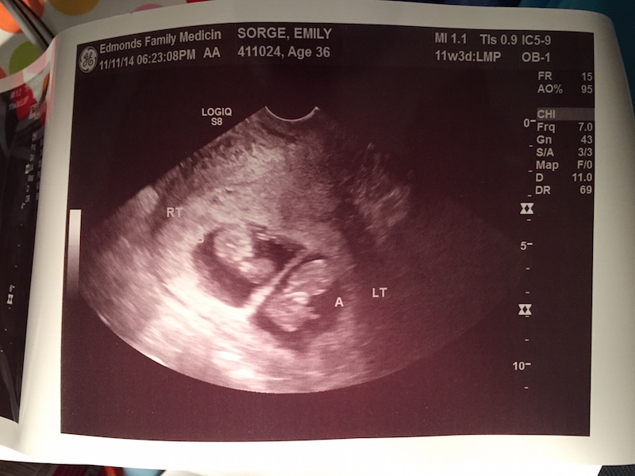

A little over a month ago, we found out Emily is pregnant. This week we had our first ultrasound, and the tech discovered something we weren't expecting: 2 babies. Twins!

We are slowly coming out of the shock of it all, and trying to figure out what this means for our family going forward. We weren't expecting to go from 3 to 5 so quickly. There are lots of logistics and things to figure out in the coming months, but I'm really excited for the road ahead.

They are due June 5 (baby A), and June 9 (baby B). Yes, different due dates are possible but that's not going to happen. Just one hospital trip for us, thank you.
