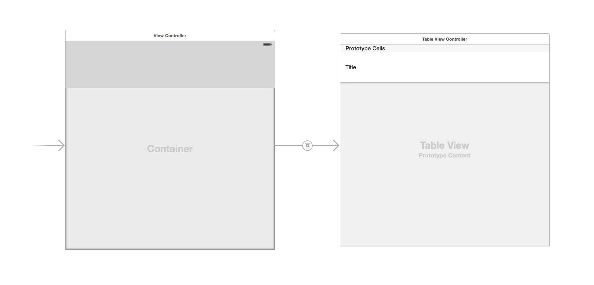
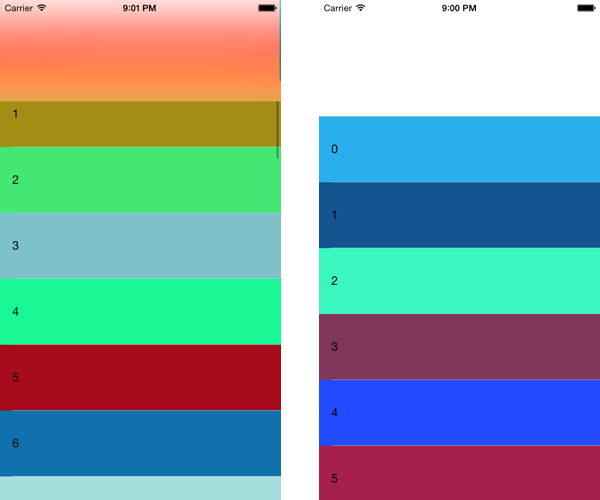

When I built [Scorebook](http://taphouse.io/scorebook) I used Storyboards for all the UI. I'm a big fan of them overall, especially for navigation. One thing that I'd used a little but not much are the container views, and embedding another view controller into my view via that container.

Before I continue, I need to give huge props to [Tim Ekl](https://twitter.com/lithium3141) for helping me get this figured out. He did a [talk on UIViewController containment for Seattle Xcoders](https://vimeo.com/110953241) that goes over this in code rather than Storyboards. Thanks Tim!

One more thing before getting started. You can find the sample project [here on Github.](https://github.com/jsorge/Storyboard-Containment)

The reason why you would want to use view controller containment really boils down to keeping components separated and reusable. A side benefit is you can avoid the Massive View Controller problem that comes about easily when building an iOS app. It’s also quite straightforward once you figure out some of the quirks.

Firs thing you’ll do in your storyboard is to drag a Container View our of the Xcode Object Library and onto your view controller. With the container will come a view controller connected by an Embed segue. You can delete this if you want to and attach whatever other view controller you like. I’ve used this with regular view controllers as well as `UITableViewController`s and `UICollectionViewController`s.

Pay attention to the segue. You’ll want to give it an identifier because it will be important in your code. Once you have your storyboard setup it should look something like this:

For my demo I embedded a `UITableViewController`, and for kicks I put my own custom header view at the top of my parent view controller, overlaying the container view. This will give us a nice effect of the table view scrolling behind the header view.

Make sure that your constraints are configured on the layout as well. I pinned the container to the parent’s `topLayoutGuide`, the bottom, and both sides.

Let’s flip over to code.

In your parent view controller, implement `prepareForSegue:sender:`, like you would for a typical navigation action. Remember the identifier you gave to the segue in the storyboard? That’s where you’ll use it. The segue fires when your parent view controller loads, so this method is where you’ll pass any data to the child view controller(s). 

The standard containment patterns apply here as well. You can send data objects to the children, and have your parent become a delegate of the child if you need to pass data back and forth. More info on the containment concept [can be found over at objc.io.](http://www.objc.io/issue-1/containment-view-controller.html)

The wrinkle that I threw in was the header view. In my storyboard, had I pinned the container to the bottom of my header I wouldn’t see any rows behind the header. But as it is my child view controller will start at the top of the screen, since that is where my `topLayoutGuide` says that it is.

To get around this is where Tim was a huge help. He came up with the idea of a protocol that could be implemented on the child view controller, which passes back the root scroll view. Using this view, and my parent’s `topLayoutGuide` I can apply new content insets to the child. If the child doesn’t conform to the protocol, I can go on.

The trick is to override `topLayoutGuide` and return an object that conforms to the `UILayoutSupport` protocol with my custom height. I just created an object that implements only that protocol for the purpose of the demo, as well as Scorebook.

Once you’ve applied the content inset, it will work just like you expect it to. Below is the beginning without the new `contentInset` on the left, and with it applied on the right.

I encourage you to look over the sample code. Let me know if you have any thoughts or questions.
