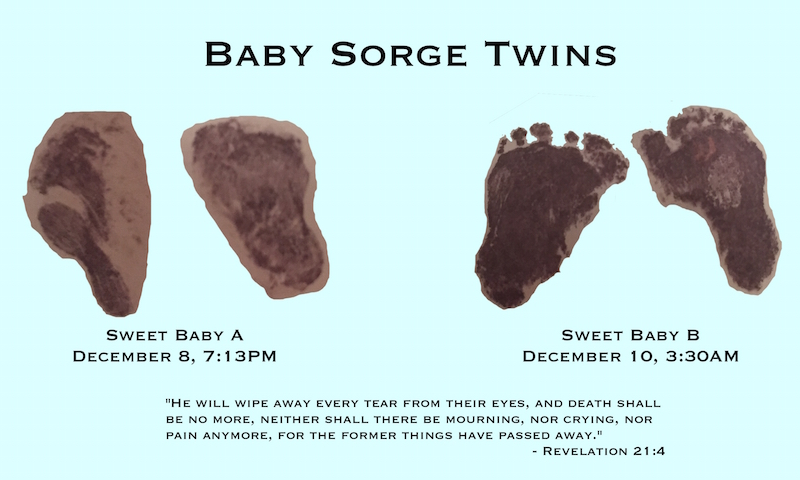

I've been writing this post in my head for the last few days. It's the hardest, saddest thing I've ever done. I'm putting this out there because telling everyone individually is going to be too hard. Too devastating.

These last couple of weeks have been excruciating. Just after we found out we were [having twins](http://jsorge.net/2014/11/14/twins/), Emily's and my thoughts went from fear of wondering how we are going to do this, to absolute excitement at the thought of 2 babies at once and all the planning that goes into becoming a family of 5, to the absolute horror and crushing reality that we're not going to meet our babies the way we should have.

On Sunday night Emily started bleeding more heavily than she had (it had started a couple weeks earlier, and we were told that it was normal) and we went to the ER. An ultrasound revealed that her uterus had openend up and Baby A's sac had ruptured, emptying out the amniotic fluid.

The doctors wanted to induce labor and then do a [D&C](https://en.wikipedia.org/wiki/Dilation_and_curettage), but both babies had heartbeats and while there was no chance that he or she (I can't stomach calling my baby "it") would survive, if she delivered the baby and placenta there could be a miniscule chance for B to make it. We prayed so hard for that miracle and gave B every shot to make it.

Tragically that didn't happen, and B was delivered yesterday morning.

We have had so much love and support from friends, family, and my coworkers through this. There have been hundreds of prayers prayed. We don't get it. I wish we could get it. I wish this didn't happen.

Tuesday night we were home and reading the last story from the Jesus Storybook Bible to Atticus, Revelation 21:4 was a big theme:

> "He will wipe away every tear from their eyes, and death shall be no more. Neither shall there be mourning, nor crying, nor pain anymore, for the former things have passed away."

I've never wanted anything to be more true, and to come more urgently than that verse. Our faith isn't in our kids. Our faith isn't in things of this world. This world is infected with sin. This world is dying. This world will be replaced with one that will never die.

Come Lord Jesus. Come.
