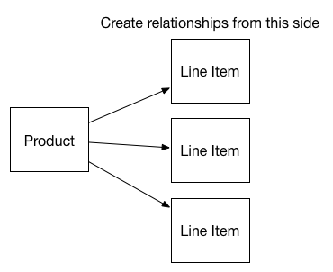

I want to finish out my schema bit with a little bit on relationships. CloudKit fully supports relationships so you can associate your data with one record type to another. However it’s not exactly like you would expect in a relational database. CloudKit supports 1:1 and 1:many relationships, but not many:many. That’s not a problem for me but it may be for some. 

In designing these relationships, the big thing to know going in is that you create the reference from the foreign-key side, not the primary side. So if you have a product that is becoming a line item, where the left side might be the product with many line items, you create the relationship on the right side with the line item. See the hand-crafted image below for clarity.



Creating a relationship is straightforward, and you use a `CKReference` object to do so. The designated initializer is `-initWithRecordID:action:` and you can send in the record ID object of the record to reference. If you don’t have the record ID, you can send in the whole record to the `-initWithRecord:action:` method. I don’t know which is better, and if you don’t have a record ID then that’s the one to use. I was going to flip back and forth, but since I decided to make the record ID at creation time I stick with the `initWithRecordID:action:` method instead.

The `action` part of the initializer refers to delete rules. Do you want the child to be deleted when the parent goes away? If so you can pass in `CKReferenceActionDeleteSelf`, and if not then you’ll want to use `CKReferenceActionNone`. It’s pretty straightforward.

From there in my CloudKit record creation method, the reference becomes just another key on the `CKRecord` object. So it gets a key, with the reference as a value, and that’s it. It looks something like this:

```language-objectivec
CKRecord *record = [[CKRecord alloc] initWithRecordType:@“Player”];
CKRecordID *personID = [[CKRecordID alloc] initWithRecordName:self.person.ckRecordName;
CKReference *personReference = [[CKReference alloc] initWithRecordID:personID action:CKReferenceActionDeleteSelf];
record[@“person”] = personReference;
```

Save the record to a database and that’s all there is to it.