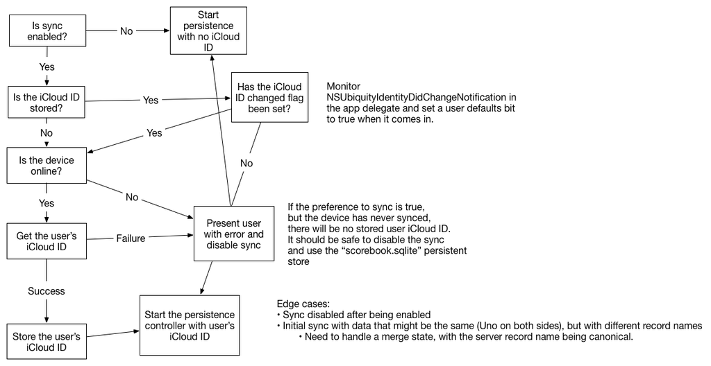

I’m feeling really confident in the things that I’ve put into sync in Scorebook. But now I’m starting to handle edge cases. Things like what happens when a user uses Scorebook without a current iCloud account, or how do I handle it when they log out and/or login again as a different user?

So I came up with a handy flowchart that I threw at Twitter and the Core Intuition Slack channel. Check it out:

I got some feedback on Slack from a guy who is doing something similar to what I am, but he’s accounting for the need to reset either the local store from the cloud or vice versa. The assumption is that at some point one or the other will become wrong and need to go back to square one. I may be overconfident here, but I’m leaning against doing that. My desired UI for syncing is a single switch on the settings screen. I think that’s how I’m going to launch, and I’ll have to see what the feedback is from users.

I’ve started writing the code to handle all of this and so far it’s not as bad as I thought it would be. I need to do a lot of testing still, though (and I’ve yet to start in on merging).

Do you see anything in the chart that might need to be changed? I’d love to hear about it!