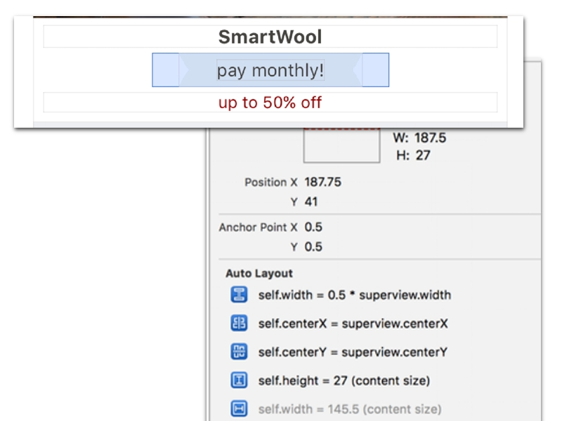
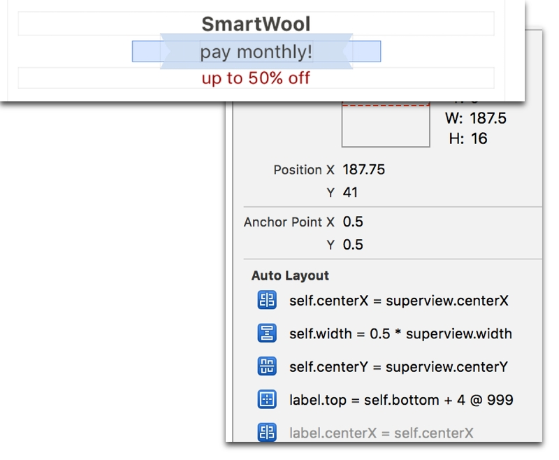

I have a custom view that I’m putting together for our app at [zulily](https://www.zulily.com). The view has a `UIImageView`, and a label that’s centered in its X and Y. I’m building this whole view in code.

So far, everything is great. I’ve got my class returning the proper intrinsic content size, the image view being populated correctly, and everything lays out as it should on the first pass in one of my collection view cells.  As you can see below, the label is sized properly vertically on the first pass inside of my `UICollectionViewCell`.

And then something happens.

When the cell goes offscreen and then comes back, it looks like this:

The view’s height gets is no longer determined by its content size. I have no height constraint on this view (and when I do, it still doesn’t matter).  The custom view has a high content resistance and the only outside constraints on it from its superview are positioning its X and Y and then spacing its top and bottom neighbors.

I think the thing I need to figure out is why the content size height constraint is going away, and then I’m good to go. Any ideas?

**Update 5/31/16**
I figured out what was going on. I was using the `-constraints` array property to track my custom constraints. The system also uses this array to get things done. So when I would reset the view based on the model I would empty the array. This messed everything up. Moving to a separate array to track my constraints for the image view and label fixed the issue.
