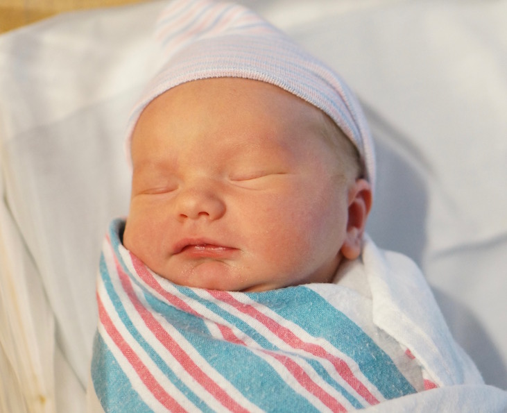

Last night, at 6:31 PM PDT, our family grew by one. Finnian Michael Sorge was born, healthy and measuring 8 pounds, 4 ounces and 20.5” long. He was due on the 14th, and overshot his target by a day. Not bad at all (especially considering his big brother [Atticus](http://jsorge.net/2013/12/31/atticus-jack-sorge/) was 11 days late, and Emily had to endure a long induction process). He came of his own volition even as we had scheduled his induction for next week. Thanks kiddo!

These last 48 hours have been quite the whirlwind. I got the call from Emily on Thursday at 6:30 as I was helping to setup for the July [Xcoders](http://www.meetup.com/xcoders/) meeting, then booked it to the hospital. He took 24 hours to get here, and we got home just after 8 tonight.

We are so thankful for all the prayers and support we have received from friends and family. It means a great deal.

To my new son, Finnian: You are a tremendous blessing to us, your family. We love you so very much and pray that your name is written in the Lord’s book of life. Welcome to the world.
