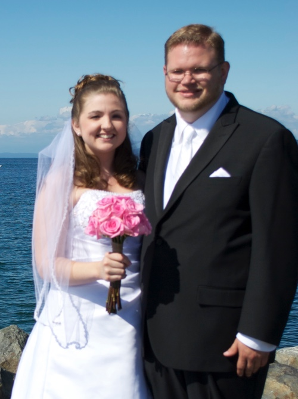

It was 5 years ago today that I married my best friend. It was a wonderful day with family and friends, but made all the sweeter now seeing what our life has become. I'm beyond blessed by getting to live life with Emily.

We've been through a lot over the years:

* [Adopted a cat](http://jsorge.net/2012/01/01/we-got-a-cat-today-meet-molly/)
* Emily quit her job
* [I started pursuing iOS development](http://jsorge.net/2013/10/02/back-to-school/) (and really any software development in general)
* [Atticus was born](http://jsorge.net/2013/12/31/atticus-jack-sorge/)
* [I quit my longtime job](http://jsorge.net/2014/05/16/new-beginning/)
* [We lost twins](http://jsorge.net/2014/12/11/goodbye-twins/)
* [I left my 2nd job in as many years...](http://jsorge.net/2015/06/25/finding-my-next-thing/)
* [...And got a better one as an iOS developer](http://jsorge.net/2015/07/20/im-hired-at-general-ui/)
* We lost an early-term pregnancy...
* ...Then got pregnant with Finnian
* [I got hired by zulily](http://jsorge.net/2016/01/14/zulily/)
* We bought a house...
* [...And then Finnian was born](http://jsorge.net/2016/07/17/say-hi-to-finnian/)

I know that there are things I've left out of that list. It's been an adventurous 5 years for the two of us and our family. And I can't wait to see what the next 5, 10, 15 years, and beyond will have in store for us.

She has been a wonderful blessing to me; a tremendous wife and mother. She is a [crown on my head](http://www.esvbible.org/Proverbs%2012%3A4/). I can't thank God enough for her and it's my hope that I can love her well all the days of our life together.

Happy anniversary, my love.