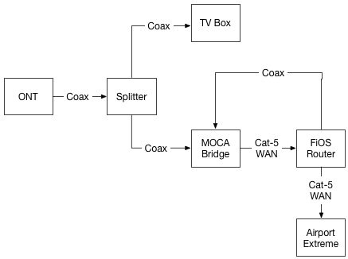

When we got FiOS installed a couple of weeks ago our network had to go through some changes. Frontier gave us not only a bridge to go from the outside connection to ethernet, but also mandated that their router be installed in the network in order for TV guide and menu functionality to remain. I wanted a way to keep my Airport Extreme router on the network, and have found a way to do just that.

This post is mostly going to go over the details I found in [this forum post](http://www.dslreports.com/forum/r31057540-Networking-HOW-TO-Bridge-G1100-So-your-Router-becomes-Primary) and give a little bit more detail into how I got things working. First of all, here’s a map of the setup:

The MOCA bridge connects from its ethernet port to the WAN port of the G1100 (my FiOS provided router). From there the router plugs into the WAN port of my Airport Extreme. The steps linked above will turn the G1100 into a bridge and the Airport will handle the rest of the network handling – Wifi, DHCP, port forwarding, etc.

My original crack at this was to hook the Airport directly to the MOCA bridge. This worked and provided internet, but the TV box had limited functionality. Following the directions and hooking things up in like in the illustration got the TV back up and running like we want it to be.

I’m still not sure how exactly the G1100 sends any data to the TV box (a Motorola QIP-7100), and if anyone does know I’d love to hear about it. My hunch was that the 7100 has some sort of wifi component that is hidden from any menu and talks to the G1100. However the G1100 has its wifi completely turned off. 

Somehow it seems that the G1100 sends data back over the coax connection to the MOCA, which may in turn go back to the ONT? I’m grasping at straws here. If I hear of a good solution to remove the G1100 from the equation I’ll definitely follow up on that.

If you don’t care about TV functionality, you can connect the Airport (or other router) straight to the MOCA and not even bother with the G1100.