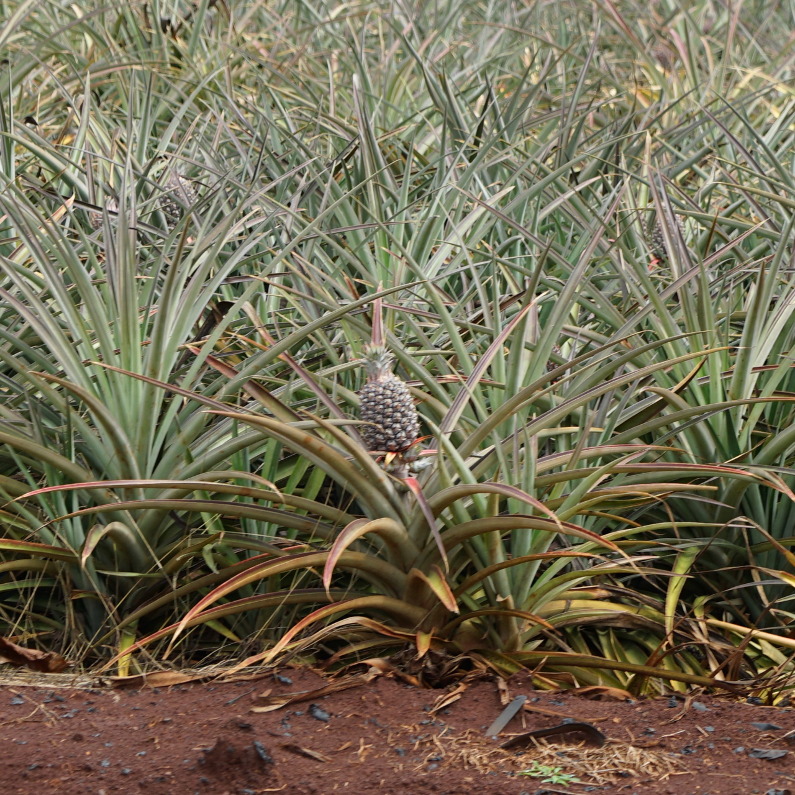

We spent the last week on the Oahu island of Hawaii, getting home late last night. It was an amazing trip and couldn’t have gone any better. We rented an AirBnB house in Kaneohe (which is the windward side of the island). The weather was quite good most of the time; even when it was raining, the rain was warm. Quite the change from Seattle.

Going into the trip I was most nervous about how the boys would do. We took them on a plane last year to Phoenix but Finnian is 20 months now and can’t be still for more than 3 seconds. We didn’t buy him a seat on the plane so he was going as a lap baby. Atticus is 4 now and we figured we could distract him with shows & movies on “his” iPad. They both did wonderfully well. A couple of screaming fits by Finnian but that was manageable by getting him to sleep.

Of course, I took along my camera. I’ve got the Sony A7II body and while I normally have a 50mm f1.8 prime on there, I wanted something that could capture the landscapes we’d be seeing and get good portrait shots of us on the trip. So I rented the Sony 24-105mm f4 zoom lens from Hawaii Camera. In short, the lens is amazing and now I want one.

Emily had done tons of research and put together a packed itinerary that got us all around the island. We hit up the Dole plantation, the North Shore, hiked Diamond Head and hung out on Waikiki beach, visited Sea Life, and went to a luau at Disney’s Aulani resort. We had a lot of fun and came home really tired.

