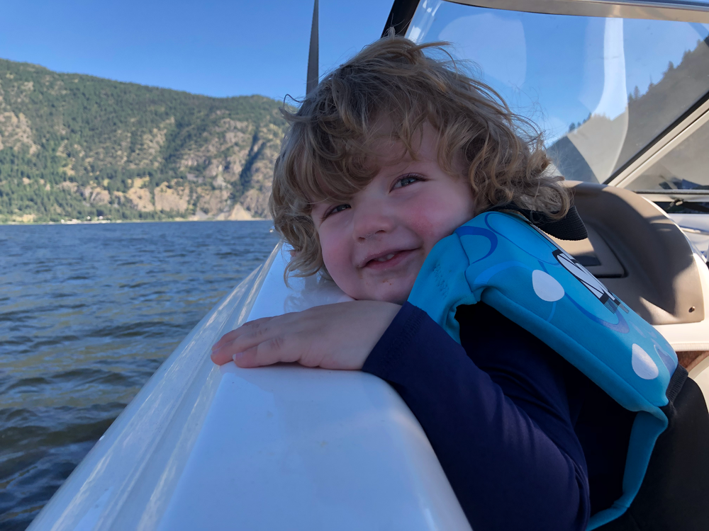

2 years ago yesterday, I was unable to attend Xcoders. I got a frantic call from Emily that her water broke, and I got a ride to the hospital from a good buddy. 24 hours later Finnian was born.

Today he turns 2. It’s hard to believe how big he’s getting. Watching him grow from newborn to our floppy haired jolly boy has been a real blessing. Happy birthday, buddy!
