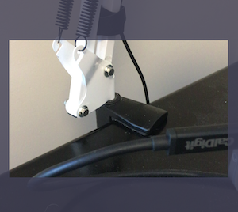
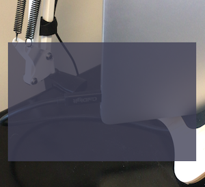

I've got a view controller with a camera view, overlaid with a partially transparent dimming view. I need to punch a hole out of the dimming view to let the camera shine through in its full glory. My first crack was the code below, and it works:

```swift
override func viewDidLayoutSubviews() {
    super.viewDidLayoutSubviews()

    let inset: CGFloat = 16.0
    let rectWidth = self.view.frame.width - (inset * 2)
    let rectHeight = rectWidth * 0.63
    let rectSize = CGSize(width: rectWidth, height: rectHeight)

    let rectOriginY = (self.view.frame.height / 2) - (rectHeight / 2)
    let rectOriginX = inset
    let rectOrigin = CGPoint(x: rectOriginX, y: rectOriginY)

    let maskRect = CGRect(origin: rectOrigin, size: rectSize)

    let maskLayer = CAShapeLayer()
    let path = CGMutablePath()
    path.addRect(self.dimmingView.frame)
    path.addRect(maskRect)
    maskLayer.path = path
    maskLayer.fillRule = .evenOdd

    self.dimmingView.layer.mask = maskLayer
}
```

Which produces what I want:


But it was redrawing too often (during transitions especially). I decided to have the mask only draw once, and I needed the view hierarchy set up. So I put it in `viewWillAppear`. Exact same body as above just different lifecycle method. Here's that result:



How in the world can the same code produce such different results?