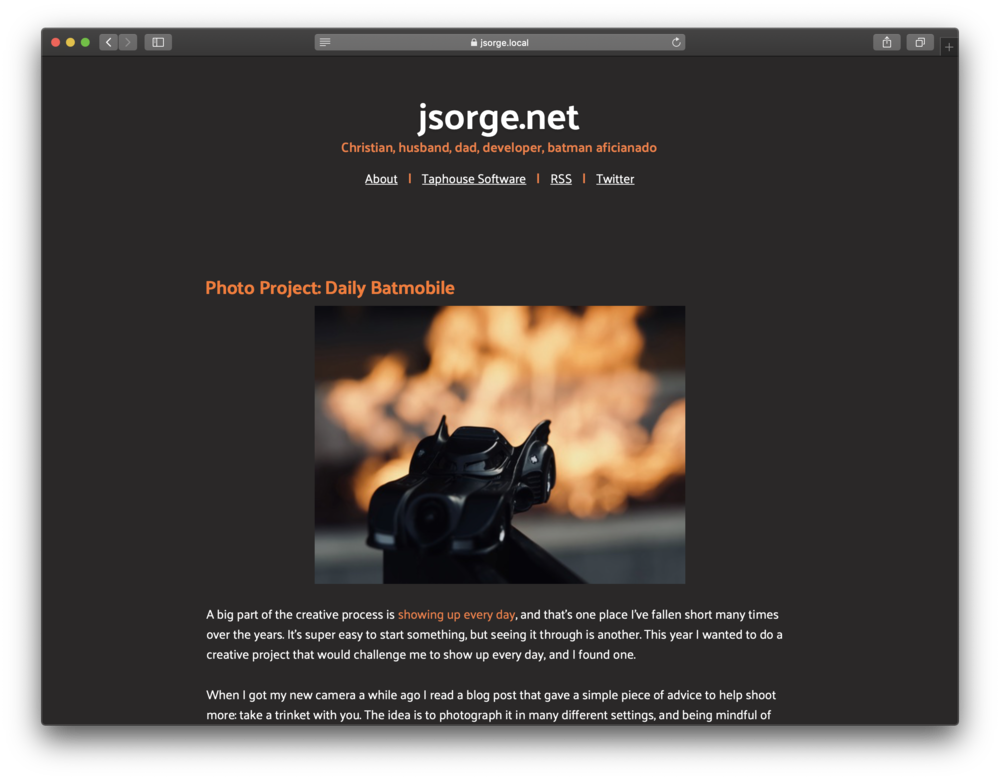

One of the projects that's been on my mind since WWDC last year when the Mac got dark mode was adding support for it to my website. I know that Safari doesn't support it directly yet (though it does in the Technology Previews) but it will soon, and the rumors are hot and heavy that iOS 13 will have it as well. I wanted to be ready, and break outside of my normal comfort zone for a bit.

I'm no CSS wizard by any means, and I found a [very helpful Iconfactory post](https://blog.iconfactory.com/2018/10/dark-mode-and-css/) detailing how they added support to their site that served as my guide. I took the time to refactor some CSS into helpful variables (a few were already in place from the Ghost theme I used to use), and it wasn't too much work to get the initial pieces in place.

The bigger work came with syntax highlighting. I use [prismjs](https://prismjs.com) for my syntax highlighting, and it consists of 2 components: some Javascript and CSS. The JS file didn't need any changes but my default CSS uses their light theme. Thankfully CSS has [handy conditional `@import` rules](https://developer.mozilla.org/en-US/docs/Web/CSS/@import) that let me use a media query. So I downloaded a separate CSS package for a dark them and applied it and all was well. This also allowed me to move the code highlighter CSS import to my main CSS file, meaning each page on the site loads exactly 1 CSS file. I count that a win in my book for maintenance.

The last thing was figuring out table styling, since I used one in [my post about iOS push notifications](https://jsorge.net/2018/08/01/ultimate-ios-push-lifecycle), and that wasn't too bad either. If you want to check out what I did, the [commit is right here](https://github.com/jsorge/jsorge.net/commit/4e5f3af2719e2c028595b3315d31bc46207380ea).

If you'd like to check out what the site looks like in dark mode, download the [Safari Technology Preview](https://developer.apple.com/safari/technology-preview/) and flip your Mac running Mojave into dark mode.
