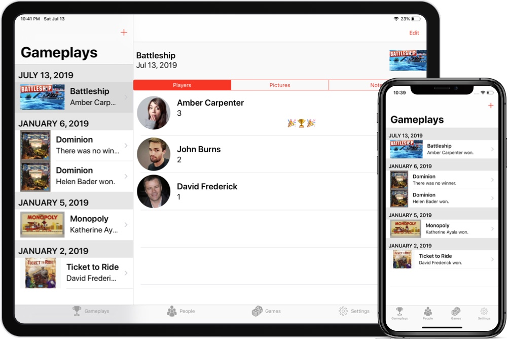

I've been hard at work over the last few months on a big update to [Scorebook](https://taphouse.io/scorebook). It's going to have a whole new interface, work on the iPad, and support the Dynamic Type accessibility feature.

The first thing that is different is the main UI. There's now a tab bar which gives easy views to your gameplays, the games you've played, and the people you've played them with. It's a really nice way to visualize the games you've been playing.

The big driver of the big UI changes was putting Scorebook on the iPad. On the bigger screen you'll get a split view, with a list of things on the left, and a detail view on the right. And with iCloud sync (which is now enabled by default) you'll be able to see your stuff on any device. It's really great.

From Scorebook's initial 1.0 launch until now, I'd been using the Avanir font across the app. I really do like how it looks but the time has come to move to the iOS system font – called San Francisco. The main reason I did this is because I wanted to support users who like the text to be a bigger (or smaller) size than the default. Accessibility is a big deal. Without it, an app is harder to use or even unusable by people who rely on those features.

With all of the work that's gone into the app, and now with being on a whole new device, I've also decided to raise the price to $4.99 USD. I'm not sure what the higher price will do for sales but I'm hopeful that people will see value in the additional work I've put in to Scorebook.

While the release date isn't set yet, I'm in the final phase of the project – screenshots. Apple has so many different devices nowadays that this is actually a really complicated part of making an app (especially as a solo developer). But I'm pleased to say that I expect to wrap the screenshots tonight and submit the app for release later this week.

Scorebook 2.0 will be a free update to all users. If you want to get in at the existing $2.99 price you can [buy it on the App Store today](https://apps.apple.com/us/app/scorebook-game-journal/id897584352?mt=8). 
