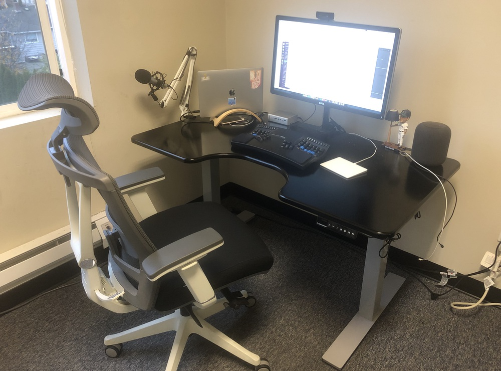

For the last couple of years I've really dialed in my desk situation. I'm really blessed in that I can have essentially the same setup in 2 places – my office near home, and my desk at the Lyft office. In this post I'll go over the gear I've got, what works and what could be better.

**The Computer**

I've got a [2018 MacBook Pro](https://www.apple.com/macbook-pro/). It's a 6-core i9 with 32GB of RAM – and our Lyft project really demands all those resources. Sure, I'd vastly prefer an iMac Pro on my desk(s) but the portability really is great to have on the whole.

**The Dock**

Here's the brains of the rest of the operation. I have a [CalDigit TS3 Plus](https://www.caldigit.com/ts3-plus) which lets me plug one cable into my laptop. From there it breaks out to video, USB, audio, and ethernet. I friggin love this thing. I used to have to plug in power, video, USB, all in separate cables. This box even sends power to my computer so it's a true single-cable plug and go.

**The Display**

For many years now I've been able to have a 27" 4k monitor on my desk. I've used Dell (pictured here) for quite some time –  it's the [P2715Q](https://www.dell.com/ee/business/p/dell-p2715q-monitor/pd) model. I know it's not 5k and the resolution could be better, but 5k monitors are a lot more expensive than I was willing to pay at the time.

I got the [Autonomous monitor arm](https://www.autonomous.ai/office-accessories/monitor-arm) last year and it's been quite nice to have the display floating. There are probably better arms (definitely more expensive ones), but this one has been just fine for my entry in to the bigger world of monitor arms.

**The Keyboard**

For a long time I used the [Microsoft Sculpt ergonomic keyboard](https://www.amazon.com/Microsoft-Ergonomic-Keyboard-Business-5KV-00001/dp/B00CYX26BC/), but recently I switched to the [Kinesis Advangage2 LF](https://kinesis-ergo.com/keyboards/advantage2-keyboard/). It's still got the nice split layout that helps with ergonomics, and the key wells help my finger travel be overall smaller. I was feeling a fair bit of pain in my right forearm and with the Advantage2 that has subsided quite a bit.

Fair warning: the layout on the Advantage2 takes _a lot_ of adjusting to. I've been using it for a little over a month and still adjusting.

**The Desk & Chair**

The desk I have shown is the [Autonomous SmartDesk2](https://www.autonomous.ai/standing-desks/smartdesk-2-home). It's adjustable to be tall for standing or shorter for sitting. I love the control panel (especially compared to my other desk at the Lyft office) because the programmable buttons let me press once and it will adjust to the defined height. On my other desk I have to keep the button held for it to move. There's plenty of space for all that I put on the surface, and when it's standing up isn't wobbly or rickety at all. Highly recommended - especially for the price. It's one of the least expensive powered desks I've seen.

I also got the [Autonomous ErgoChair 2](https://www.autonomous.ai/office-chairs/ergonomic-chair) for the times when my desk is lowered. It's pretty comfortable – though the [Steelcase Gesture](https://www.amazon.com/dp/B016OIF2U4/) that Lyft provided is much more comfortable but a lot more money.

You can follow [this link](http://bit.ly/2zuUmOR) to get at least $15 off your order with Autonomous (full disclosure: this is a referral link so I get something back too).

**Miscellaneous**

* I love, love, love the [Magic Trackpad 2](https://www.apple.com/shop/product/MJ2R2LL/A/magic-trackpad-2-silver) for all my mousing needs.
* The [HomePod](https://www.apple.com/homepod/) is a great little speaker that more than fills the space.
* The [Logitech HD Pro Webcam C920](https://www.amazon.com/gp/product/B006JH8T3S/) is what I use for video calls. It more than gets the job done for me.
* I use the [Audio Technica ATR2100](https://www.amazon.com/gp/product/B004QJOZS4) USB mic for recording podcasts and video calls. I get tons of compliments of how good my audio is.
* I also under-mounted a power strip on the front-right side of the desk (under the HomePod) so that I didn't have a bunch of cords laying on the ground.

That's my setup. I think the big thing missing from the image above is a little filing cabinet. It's not crucial but I currently stash papers & miscellaneous little stuff behind the comfy chair in the corner (not pictured).
