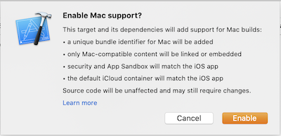

Apple this year brought a new technology called [Catalyst]() to the Mac. Going in to WWDC back in June, it was thought that Catalyst (née Marzipan) was going to be the future of the Mac. Essentially it lets developers write an app for iOS using the UIKit frameworks and have it work as a native Mac app. I think the results so far have been hit-or-miss but it's still super early days for this technology.

I'm starting a new project and wondered while updating my project templates – what does making an iOS app work on the Mac actually do to your project? Let's take a look!

Step 1: Make a new, empty iOS project. To make things easy, have Xcode create a git repo. This will set the stage for viewing differences.

Step 2: Add a couple extra targets. Lots of apps nowadays are moving towards a modular approach. This is great because it lets us keep our code separated in such a way that we can easier test our individual pieces and gain reuse by sharing frameworks across apps. I don't know offhand what Catalyst means for my dynamic frameworks and static libraries. Let's add a couple different types of these modules.

Step 3: Commit the current state. We want to capture the repo's place in time.

Step 4: Click the Mac checkbox. In your app's Deployment Info section, check the Mac device target to get going. You'll see the following sheet drop down.



Moving ahead will surprisingly just make a few changes to your project. There is a new entitlements file added with a couple of entries:

* com.apple.security.app-sandbox
* com.apple.security.network.client

I suspect if your app is using iCloud or other permissions that further entitlements may be added here as well, but in our sample project we're not using any of that.

Additionally there are 3 new build settings on _only the app target_:

```
CODE_SIGN_ENTITLEMENTS = Catalystic/Catalystic.entitlements;
SUPPORTS_MACCATALYST = YES;
DERIVE_MACCATALYST_PRODUCT_BUNDLE_IDENTIFIER = YES;
```

There are a couple of interesting things here. First, only app targets need to be updated in build settings. Your other module's code may need some slight changes to source, but no build settings need to change. Super cool.

The other interesting thing is the `DERIVE_MACCATALYST_PRODUCT_BUNDLE_IDENTIFIER` setting. I don't know what would happen if this was set to `NO`. Thankfully there's a handy Help button next to our Mac version's bundle identifier. It's help page contains this text:

> You can change the Mac version bundle ID format but then you need manually sign the app. Set the Derive Mac Catalyst Product Bundle Identifier (`DERIVE_MACCATALYST_PRODUCT_BUNDLE_IDENTIFIER``) build setting to `NO``, add a macOS conditional value for [Product Bundle Identifier (`PRODUCT_BUNDLE_IDENTIFIER``)](https://help.apple.com/xcode/mac/11.0/index.html?localePath=en.lproj#/itcaec37c2a6?sub=dev0f43bcc41) and [Provisioning Profile (`PROVISIONING_PROFILE_SPECIFIER``)](https://help.apple.com/xcode/mac/11.0/index.html?localePath=en.lproj#/itcaec37c2a6?sub=devb5b06a8dd), then [manually sign the app](https://help.apple.com/xcode/mac/11.0/index.html?localePath=en.lproj#/dev1bf96f17e).

So that's pretty cool. Xcode will automatically give us the `maccatalyst` prefixed bundle ID as a convenience to signing our apps across the embedded executables like app extensions. And if you want to manage it all yourself (say by replacing the `maccatalyst` prefix with a `.macos` suffix) you can do that too.

So there you have it. Just a few steps and you too can have a Mac app from your iPad source base.

**WWDC Resources**

* [Introducing iPad Apps for Mac](https://developer.apple.com/videos/play/wwdc2019/205/)
* [Taking iPad Apps for Mac to the Next Level](https://developer.apple.com/videos/play/wwdc2019/235/)
* [Designing iPad Apps for Mac](https://developer.apple.com/videos/play/wwdc2019/809/)
