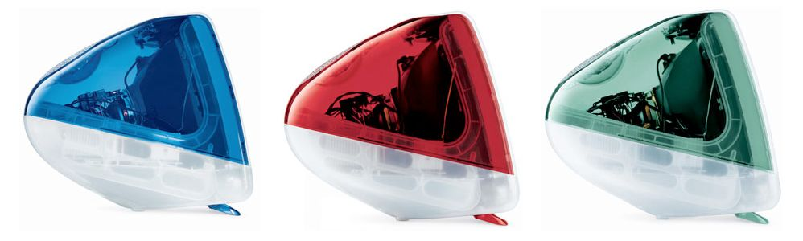

When the Apple stores first opened, the Genius Bar was a much different experience than it is today. For one it actually was a bar you could go to at the back of the store. But they also wanted to answer the really tough questions. And if the Genius you were talking with didn’t know the answer, there was a Red Phone to dial home and talk to someone in the next level up in support. It really was a fun experience.

Prior to the Seattle area getting its first Apple store my family and I went on a vacation to Las Vegas and we went to the Fashion Show Mall so I could see their store. And I had just the question to stump their Geniuses:

I worked at an Apple Authorized Service Center and had been doing service on the iMacs with slot loading optical drives (like the one pictured above). Whenever I would need to erase a hard drive and restore the operating system I noticed that the desktop wallpaper color matched the color of the case. So a Ruby iMac would get a Ruby colored desktop, and same with Sage green, Indigo blue, and so on. How did they pull this off?

I do also have some inside information to help rule out some possibilities:

- The main logic boards did not know anything about the shell color. There was 1 part per model of iMac and they were not ordered by color of case. These boards hold _everything_: CPU, graphics, memory, all the ports, all of the guts.
- Same story for the other big board: the analog/video board. It was not ordered by color either.
- The only other real parts inside were the optical and hard drives.
- Except for the speakers.

And that last part is what I think happens. The speakers on these iMacs were colored to match the back case (and you could see them through the translucent base). I _think_ that there was some chip in the speakers that would indicate to the system what color it was and then the system would pull the appropriate wallpaper.

If you or someone you know may happen to know how this worked I would love to know the answer!

PS: Special thanks to the Xcoders group last night for encouraging me to post this after I told the story. It was a ton of fun to speculate together. Community is awesome 🙂
