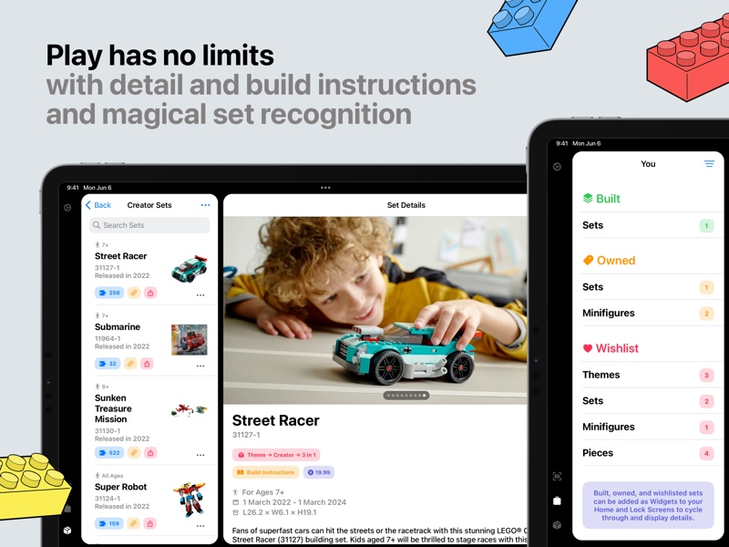

I love indie software. It's one of the things that I love about Apple's platforms. And being an indie is something that I've wanted to do for a long time (no this isn't a post where I say I'm quitting my job). So when a really cool opportunity crossed my path to acquire an exsiting app I decided to take the leap.

Meet Baseplate! It's a fun app for LEGO collectors to manage their collections. Over the past few years I've gotten pretty heavy into collecting and building and I've had a great time getting to know Baseplate. I hope you love it too. Check it out on the App Store](https://apps.apple.com/us/app/brick-catalog-baseplate/id6737250348)!

[Go get Baseplate on the App Store](https://apps.apple.com/us/app/brick-catalog-baseplate/id6737250348)

Baseplate was originally developed by [Shihab Mehboob](https://x.com/JPEGuin) and released earlier this year. I'm super impressed at how he was able to build the app so quickly – and for all of Apple's platforms (save tvOS). It's been a lot of fun to dig in to the app and learn from a developer who did the thing that I've constantly struggled with: shipping the app!

The whole process of taking the app over has reinvigorated me for my own apps. I have put Scorebook back on the store and am working on updates to it too. I was able to rebuild my [Taphouse website](https://taphouse.io) using Tailwind CSS as well as the newer version of Vapor. I've sorted out some of the things that slow me down such as build and deployment processes and have attempted to take the friction out of building apps as much as I can.

I'm also going to try and market Baseplate better than before. I created a [Mastodon profile](https://indieapps.space/@baseplate) for it and will be working on features to let users post about their collection super easily.

So go give the app a whirl. I hope you like it!
