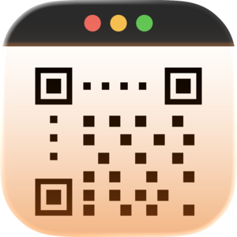

**Updated to include the prompt that I used**

Over the years I've always been very impressed when I hear stories of developers building and shipping an app very quickly. But for me that experience had never come together – getting the idea (which I could execute quickly), actually making the app to a standard that I'm happy with as a simple 1.0, updating all the marketing materials, and the 28 other steps that all go in to making a release. It's a lot of work!

However, on Monday last week things came together. And I'd say it was a highlight of my Christmas break from work.

TL;DR: I've got a new Mac app – Decoder. It will use your Mac's camera to scan any kind of code, barcode, QR code, Starbucks gift card, etc.. Check it out at https://taphouse.io/decoder.

### Backstory
My wife Emily had gotten a bill in the mail that had a QR code on it so that you can pay by phone. However (and I've had this feeling often as well) entering the data associated with the bill is easier done on the Mac. The problem is that the Mac has no built-in QR code scanner, unlike the iPhone. So I went searching on the App Store for an app that could help her utilize her webcam to scan the code. There are a couple out there but neither seemed all that great.

I've been working with AI coding tools more (Claude Code and Codex are my current weapons of choice) and so I created a new git worktree in my monorepo and opened Claude code to it and gave a simple prompt:

> I'd like to make a new app for the Mac which turns on the camera and lets the user scan a QR or barcode. Let's call the app `Decoder`. Take a look at the pattern of my other apps and make a new one in the Apps directory with an Xcodegen definition file. The app should also follow common Mac patterns and fit in well with the rest of the ecosystem.
>
> Once we have the basic shell up and running we can talk about other features.

The result took just a couple of minutes and out popped an app that interacted with the camera and scanned the code. I showed Emily the app and she confused it with one that I had sent her way (she had already paid the bill, I was just having fun). Her surprised look when I said that I just made this was a lot of fun to see.

### Claude's Initial Output
I have had a bit of experience with Claude over the past year, and I've built up a decently extensive set of rules in my `.claude` folder. But I have to say that the initial output from my meager prompt above was _very good_. It made an XcodeGen yml manifest similar to my other apps, and I was able to easily generate the project the first time. My monorepo is anything but conventional but it works very well for me. Claude plugged in to it and added the new app structure seamlessly.

The SwiftUI code it produced also was really good. It produced easy to read and reason about views, and the backing models were all in the modern `@Observable` pattern. I didn't think it got too clever about anything. As a first examination and running of the output I'm very impressed.

### Polishing for Distribution
I figured that it could be fun to see what it might take to get this app on the App Store. There were some missing niceties like history preservation and a nicer UI for when the camera is off. For history between sessions I leaned on the [swift-sharing package](https://github.com/pointfreeco/swift-sharing) from Point Free. It added the package to my XcodeGen manifest and integrated it perfectly (I was able to point to my example implementations in Baseplate as a pattern).

Next came the app icon. I've used Bakery in the past to make quick icons using SF Symbols, but that's disallowed in the App Store. Claude can't create images, but it can create SVGs. Since Decoder is basically a full-window code scanner I came up with the concept of a Mac window with a QR code inside and Claude generated the code to make an SVG. This process actually took quite a few iterations but I got to a place I was happy enough with. The biggest creative change I had to make was putting the macOS window stoplights in the center of the title bar because otherwise Tahoe's roundrect clipping would slice the red one right off. It took a few iterations to get the sizing correct for Icon Composer so that the SVG would fill the icon but we got there. I'm actually pretty happy with how the icon turned out.

### Business Time
While I wanted Decoder to be free, I also knew that having a way to get a few dollars for it would be nice. I've used RevenueCat with Baseplate already and I've seen other apps implement a tip jar feature so I asked Claude to add a tip jar, with a primary action button in the toolbar. Claude spun for a little bit and did a very nice job of producing a view with buttons that can act as individual "tip" buying buttons, hooked up to RevenueCat (after having added RevenueCat's SDK to my XcodeGen manifest).

The next step was to add the identifiers for my in-app purchases to App Store Connect and hook them up to the RevenueCat backend. I did these steps by hand because I'm not sure if there's a way to do them using automation.

### Web Updates
The next piece of the puzzle to ship Decoder to the App Store is a website. I have a decent if not overdone process for the taphouse.io website – it's a [Vapor](https://vapor.codes) site that could absolutely be static but is not. I use [Leaf](https://docs.vapor.codes/leaf/getting-started/) for the templates and have one shared template for both Baseplate and Scorebook. I didn't want to go overboard with screenshots so I decided to go with a single, simple one for now.

I have a separate repository for my web services (there's the website and a small API I run), and I added that working directory to my session with Claude Code. From there I gave it the prompting to look at how my other app pages are set up and to create a page for Decoder. It went to work and reused the template I had for the other apps and made something... okay. But after some iteration I was able to get a new template spun up that Decoder could use. It also added the app to my dropdown listing and updated the home page.

### App Review
This project began at about 5pm PST on December 29. By 11am on December 30 I had the app in a good state, tested the in-app purchase flow, and updated my website. I asked Claude to give me the marketing spiel, looked it over, and submitted it for review.

> **A Brief In-App Purchase Aside**
>
> The workflow for adding in-app purchases to an app is strange and easily confusing. I say this having gone through it with Baseplate at the end of 2024, and at Adobe having gone through it with [Premiere's](https://apps.apple.com/us/app/adobe-premiere-video-editor/id6742757464) launch in September of last year. In-app purchases (consumable, non-consumable, or subscriptions) need to be approved by Apple before they can be sold in an app and the process for getting them approved gets bundled up with an app's submission.
>
> After I submitted Decoder for app review I found a couple of bugs that I wanted to take care of. So I did that, made a new build, and developer-rejected the existing build that I had submitted before. This took my app (which also had the 3 tip jar in-app purchases submitted as well) back to the "Prepare for Submission" state. However when I went back to submit the updated build I couldn't find the 3 tip jar items to add back and looking at their product pages in App Store Connect showed them still waiting for review.
>
> It seems to me that the process of approving an in-app purchase has much less transparency than a regular app. There's no way to see their review status in the same way as an app, and the fact that bundling the submission with an app but rejecting the app doesn't affect the in-app purchases is unnerving at best.

It took until January 4 to get the app in to App Review, but once it did the review was just 30 minutes. The in-app purchases for the tip jar got approved (even though they were no longer part of the submission) and Decoder is now for sale!

This project was a lot of fun and seeing how well the tooling like Claude Code can help me put together an app and its marketing material – and in so short an order – was really eye opening. I have started working on another, much more complicated, app that I hope to have progress updates on in the coming months. It will take a lot more time than Decoder did but it also does quite a bit more. I've also dusted off an app that I started a few years ago and have been working on it too (I'm writing this post using it in fact) and may be able to polish it up for release.

I'm definitely feeling an energy for building apps of my own that I haven't felt for a while and I'm excited to see how I can move these projects forward in 2026.
