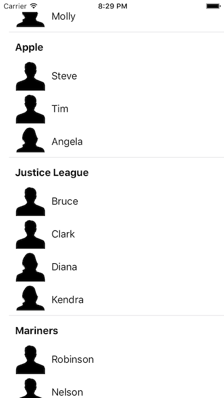

I’m working on a redesigned implementation of the order status screen for my [day job](https://www.zulily.com), and one of the design challenges has been to list the products ordered on a given order (which itself is in a list of orders). Enter `UITableView`! It’s a trusted class that every iOS programmer should know intimate details about.

So I wondered if there was a sane way to put a table view within a table view cell. Such discussions have [stemmed](http://inessential.com/2012/12/31/uitableviewcell_is_not_a_controller) huge [debates](http://corporationunknown.com/blog/2013/01/01/uitableviewcell-is-not-a-controller-but/) about what defines the “controller” portion of MVC. Those discussions aren’t the exact topic I want to tackle – but my position is that I have no problem passing a model to a view, and letting the view configure itself.

With that in mind, let’s see how it works together. [The sample code can be found on Github](https://github.com/jsorge/nesting-tables). The app is really simple, visually. It’s a table view, with each cell representing a company. Inside each cell is a table view of its own, for each of the workers.



My model is really simple. I have 2 structs: `Worker` and `Company`. A company has a member called `workers`, which is an array of `Worker` objects. I have a function that generates an array of companies, and that is what powers our outer table view.

The view controller is the data source for the table view, but I did use class extensions to encapsulate those protocols into their own chunks. I’m really liking that aspect of Swift for things like that.

My company cell class has an API method called `- configureWithCompany(_)` on it, and I pass the company to the cell. There’s some force casting that I’m not sure how to get around at the moment, so I would love any suggestions there. Once I pass the model over to that cell, it’s all done. It can handle laying itself out.

My view controller is also the delegate for the table view. This is the part where things get kind of hairy.  My table view needs to know how big the base height of the cell is, and how big each addition of a worker is.  Here’s what that looks like:

```swift
func tableView(tableView: UITableView, heightForRowAtIndexPath indexPath: NSIndexPath) -> CGFloat {
        var height: CGFloat = 45
        guard let companies = companies else { return height }
        
        let company = companies[indexPath.row]
        for _ in company.workers {
            height += WorkerTableViewCell.desiredCellHeight
        }
        
        return height
    }
```

I don’t like this implementation since it feels hacky, but it works. I can know how big each worker’s cell is (I put a static variable on the worker cell to get this), so I add that height for each worker to the cell’s base height. Voila!

Now for the worker cell. This is where the magic happens.

First, I lay out my cell in a XIB. I did it this way because that’s how I did it on the work app because the cell gets reused inside of this table and another. In the code, I configure the table view in `- awakeFromNib()`. That’s where I know that the table view outlet will be filled and I can play with subviews. Any other time and I’ve found problems. So it’s at that point that I assign the table view’s data source, and register my custom cell using `- registerNib(_, forCellReuseIdentifier:)`.

Then comes the implementation of the table view delegate, which is boiler plate essentially. I grab the worker from the company, create my worker cell and configure it with the worker. That’s it!

Now, if my app could target iOS 9 (dropping iOS 8), then this whole thing could be replaced with a stack view. But we target 1 version back, so that was off the table. In the future this may well get ripped out and replaced with a `UIStackView`.

I’d love to know how this could be improved, too. If you have thoughts, get in touch!