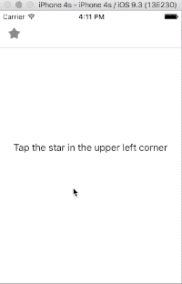
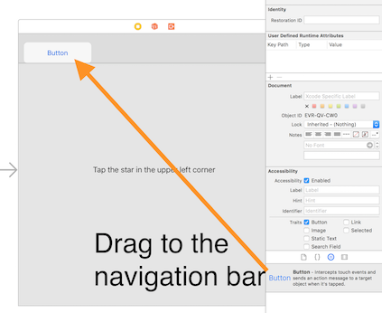
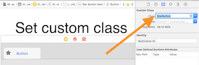
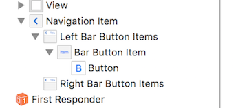

Andrew Bancroft has a great [writeup showing how to add buttons to a navigation bar in storyboards](https://www.andrewcbancroft.com/2016/04/14/adding-buttons-to-the-navigation-bar-with-storyboards/). I’ve used that technique a lot over the course of my working in iOS. There have also been times where I want my own custom button inside of the navigation bar. So I thought I’d extend his original to cover the custom buttons.

Here’s what we end up with:

## How to
First, follow the basics from Andrew’s write-up. Get your scene setup, and embed it inside a navigation controller. Don’t put any buttons in your navigation bar just yet. Then:

#### Step 1
Drag a `UIButton` object from the object explorer to the navigation bar. It’s important to drag a `UIButton` and not a `UIBarButtonItem`, since that’s how we will get our custom class.

#### Step 2
Create a custom UIButton subclass, preferably one that conforms to `IBDesignable`. The `IBDesignable` bit will allow you to actually see the button in the navigation bar. I use [PaintCode](http://www.paintcodeapp.com) to create my icons that I use in code.  Don’t overlook creating the states of the button, like pressed and inactive. Then set the custom class of the button.

You should keep the drawing of your button fairly small, and not dynamic. The button I’m showing here is 30x30. Drawing in code also means that you don’t need to worry about scaling issues. The system will take care of 1x, 2x, and 3x. That’s a big win in my book. At this point, you should be able to see what your button looks like.

#### Step 3
The next 2 steps don’t matter much in terms of order, but both are key to getting the appearance right. Remove the text from the button. It will look really strange if you don’t.

#### Step 4
Change the width of the button’s frame in the measurement inspector. Auto layout doesn’t play in the navigation bar from what I’ve seen. So doing this the manual way is the best way.

#### Step 5
Wire up the button’s action. The quirk here is to wire the action to the `UIButton` and not the `UIBarButtonItem` that contains the button (see the screenshot below). This is a normal `IBAction` that you would use other places in your code.

And that’s it! You now have a custom `UIButton` in your `UINavigationBar`. Hope this was helpful. If you want to see the whole sample project, [check it out on GitHub.](https://github.com/jsorge/Custom-UIBarButtonItem-Storyboard)